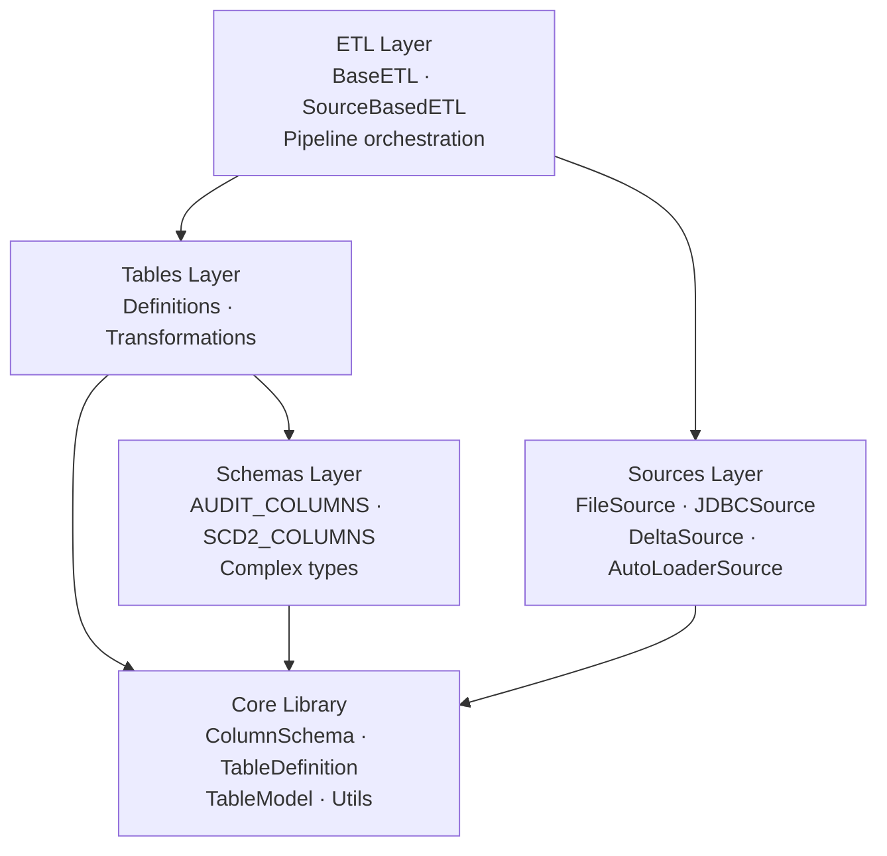
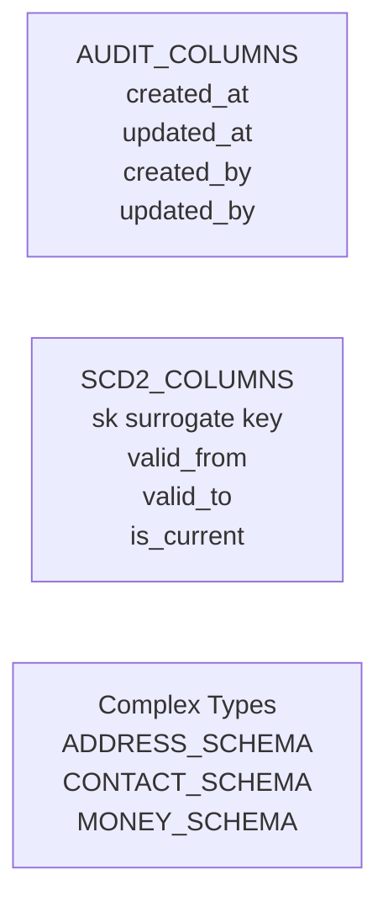
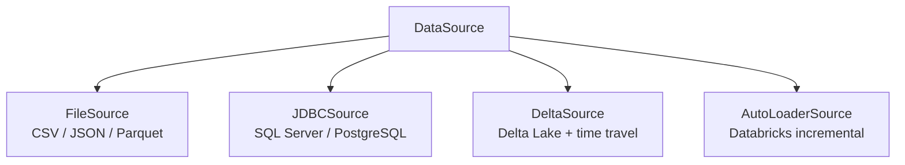
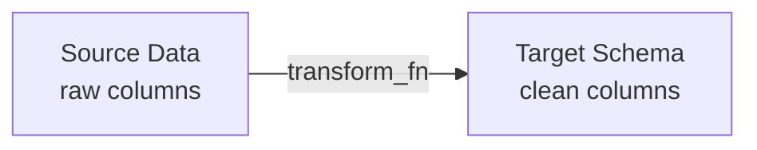
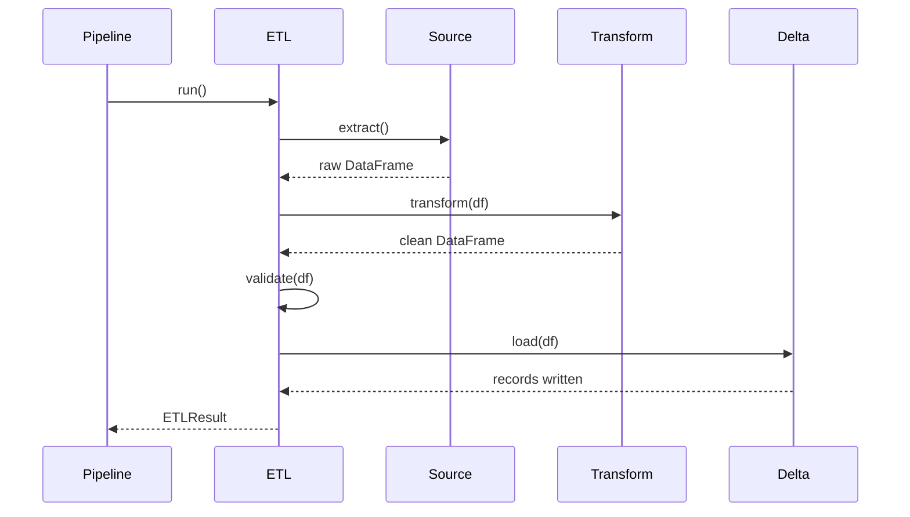
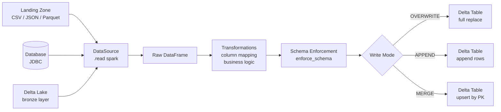

# Architecture

## The Layered Model

TableKit organises code into four layers. Each layer depends only on the layers below it. Nothing reaches up.

---

## Layer Responsibilities

### Core Library

The foundation. No business logic. No opinions about your data.

- `ColumnSchema` — a column with its type and metadata
- `TableDefinition` — a validated, composable collection of columns
- `TableModel` — full table identity with environment awareness
- `enforce_schema()` — cast DataFrames to target schemas
- `mask_pii_columns()` — type-aware PII masking

This layer is stable. It changes only when the core abstractions need to change.

### Schemas Layer

Reusable column sets and complex type definitions that belong to no single table.

These are defined once and composed into any table that needs them. The alternative — copy-pasting — guarantees inconsistency over time.

### Sources Layer

Declarative data source definitions. A source is defined once and can be attached to a table or used directly in an ETL.

Every source has the same interface: `source.read(spark)`. The ETL layer does not care where the data comes from.

### Tables Layer

Where your actual tables live.

**Definitions** — the schema for each table, composed from core components and schemas.

**Transformations** — functions that convert raw source data to the target schema. Pure functions: DataFrame in, DataFrame out.

Keeping transformations separate from definitions means you can test them independently, reuse them, and reason about them in isolation.

### ETL Layer

The orchestration layer. It connects sources to tables through transformations.

`BaseETL` defines the contract. Subclasses implement `extract()` and `transform()`. Everything else — validation, loading, result tracking — is handled by the base class.

---

## Data Flow

A full pipeline run from source to Delta table:

---

## Why This Structure

**Single source of truth.** A table's schema, source, and column mapping live in one place. Not scattered across notebooks and YAML files.

**Composability.** Columns, definitions, and sources are all composable. Build complex things from simple, tested pieces.

**Testability.** Each layer can be tested independently. Transformations are pure functions. Sources can be mocked. The ETL contract is defined by `BaseETL`.

**Consistency.** Audit columns, SCD2 patterns, and complex types are defined once. Every table that uses them is automatically consistent.

**Environment safety.** Environment-aware naming is built into `TableModel`. You cannot accidentally write to prod from a dev pipeline if the environment is set correctly.
