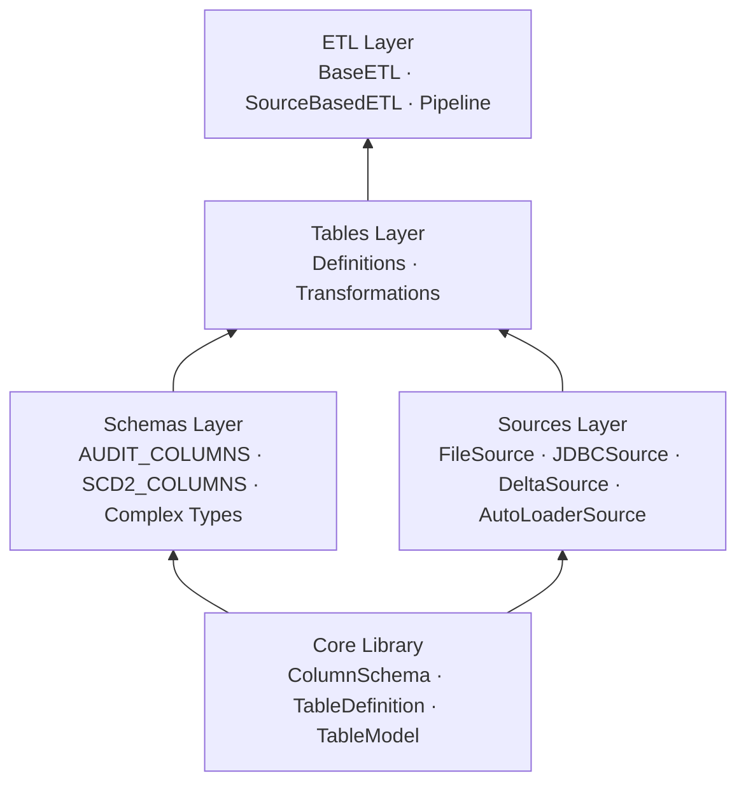
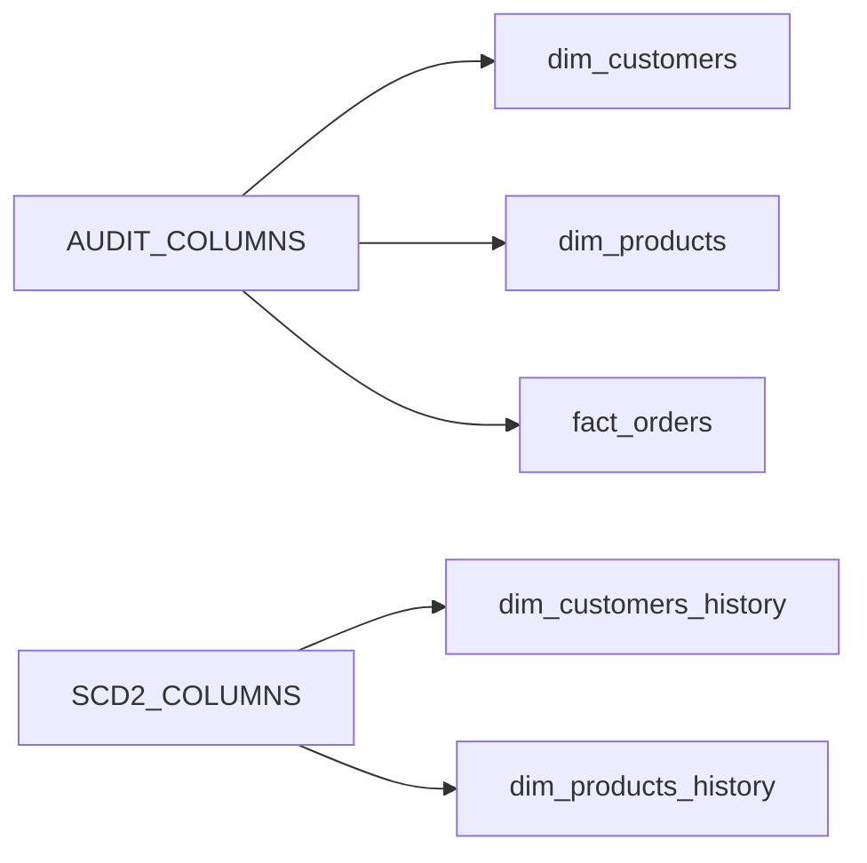
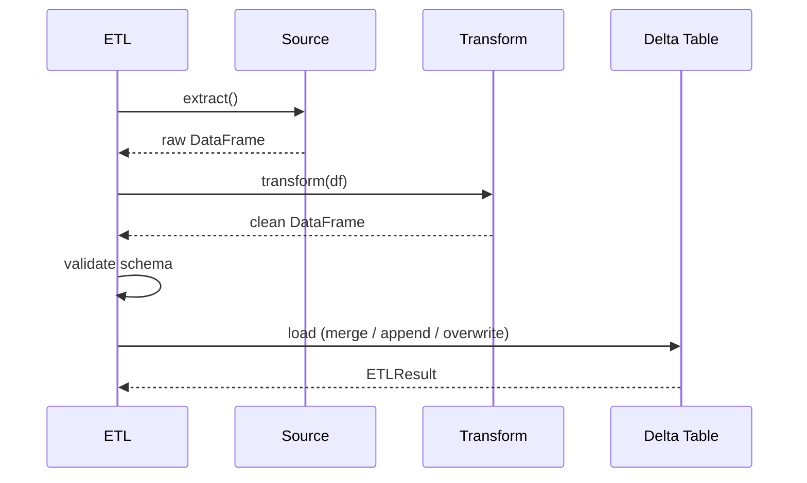
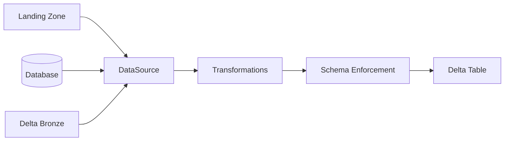

# Architecture

## The Four Layers

TableKit organises data engineering code into four layers. Each layer depends only on the layers below it.

---

## Why Four Layers

Most data pipelines mix everything together. Schema definition, source reading, transformation logic, and write operations are all in the same notebook or class. Changing one thing requires understanding everything around it.

TableKit separates these concerns so each type of change has one place to make it.

---

## Core Library

The foundation. No opinions about your data, no business logic.

Provides: typed column definitions, composable table schemas, environment-aware table identities, schema enforcement, and PII masking utilities.

---

## Schemas Layer

Reusable components that belong to no single table.

Define audit columns once. Every table that needs them composes them in. One change propagates everywhere.

---

## Sources Layer

Where data comes from is a first-class concern, not an implementation detail.

Every source has the same interface: `source.read(spark)`. The ETL layer does not care about the type.

---

## Tables Layer

Two folders. Two jobs.

**Definitions** — schema, source, and column mapping for each table. Everything needed to describe it.

**Transformations** — pure functions that convert raw source data to the target schema. A DataFrame goes in, a clean DataFrame comes out.

---

## ETL Layer

Connects sources to targets through transformations.

---

## Data Flow End to End

---

## Why This Structure

**One place per change.** Schema change → edit the definition. Source change → edit the source. Transformation change → edit the function.

**Composability.** Columns, definitions, and sources are all composable. Build complex things from simple tested pieces.

**Testability.** Transformations are pure functions. Sources are injectable. Each layer can be tested independently.

**Consistency.** Audit columns and SCD2 patterns are defined once. Every table using them is automatically consistent.

**Environment safety.** Environment-aware naming is built into `TableModel`. You cannot accidentally target the wrong catalog.
