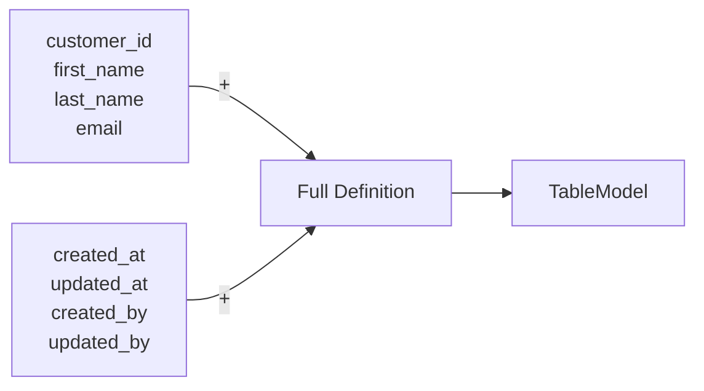
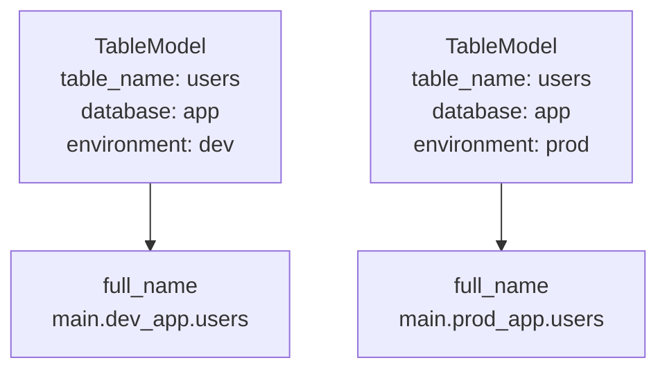

# Core Concepts

TableKit is built on three core objects. Everything else builds on top of them.

---

## ColumnSchema

A `ColumnSchema` is the smallest unit — a single column definition with all its metadata.

```
ColumnSchema
├── name          → column name in the table
├── type          → PySpark DataType (StringType, IntegerType, etc.)
├── nullable      → whether nulls are allowed (default: True)
├── comment       → description for data catalog documentation
├── is_primary_key    → marks this column as part of the PK
├── is_natural_key    → business key used for merge operations
├── is_clustered_by   → include in CLUSTER BY for Delta optimization
└── always_as_identity → auto-increment (LongType only)
```

### Why this matters

Without this, you write:

```python
StructField("customer_id", StringType(), False)
```

There is no way to know from this line alone whether `customer_id` is a primary key, whether it should be clustered, or what it represents. You have to look at the whole schema and hope there's a comment somewhere.

With `ColumnSchema`:

```python
ColumnSchema(
    name="customer_id",
    type=StringType(),
    nullable=False,
    comment="Unique customer identifier",
    is_primary_key=True,
)
```

The intent is explicit. The IDE knows the type. The schema knows what the primary key is. No guessing.

---

## TableDefinition

A `TableDefinition` is an ordered collection of `ColumnSchema` objects. It validates the collection and provides schema generation.

```
TableDefinition
├── columns          → list of ColumnSchema
├── primary_keys     → derived: columns where is_primary_key=True
├── natural_keys     → derived: columns where is_natural_key=True
├── cluster_columns  → derived: columns where is_clustered_by=True
└── column_names     → derived: all column names as a list
```

### Composition

The most important feature of `TableDefinition` is that definitions can be combined with `+`:

```
customers_columns + AUDIT_COLUMNS = full_definition
```



This means you define audit columns once and reuse them everywhere. SCD2 columns once. Address structs once. No copy-paste.

### Schema generation

`TableDefinition.to_spark_schema()` converts the definition into a PySpark `StructType`. You never write `StructType` or `StructField` by hand.

---

## TableModel

A `TableModel` wraps a `TableDefinition` with the full table identity: name, database, catalog, and environment.

```
TableModel
├── table_name          → the table name
├── database            → the schema/database
├── catalog             → Unity Catalog name (default: "main")
├── environment         → dev / staging / prod
├── definition          → the TableDefinition
├── source              → optional linked DataSource
└── column_mapping      → optional source-to-target column map
```

### Environment-aware naming



The same table definition produces different fully-qualified names per environment. No string manipulation in pipelines. No environment variables scattered across notebooks.

### Source binding

A `TableModel` can hold a reference to its data source:

```
TableModel
└── source: FileSource(path="/landing/customers/", format="csv")
└── column_mapping: { "customer_id": "id", "email": "user_email" }
```

When the ETL layer reads this table, it knows exactly where to get the data and how to map columns. The source is part of the table definition, not hidden in pipeline code.
