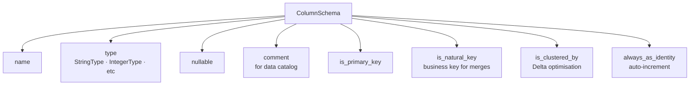
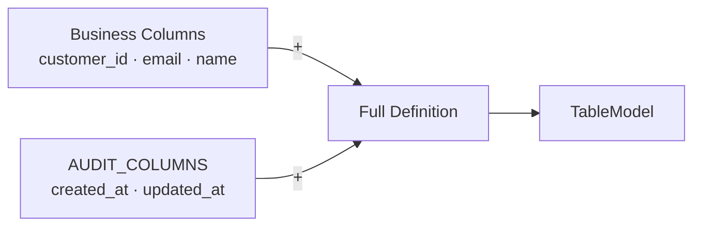
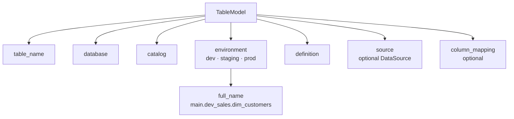

# Core Concepts

TableKit is built on three core objects. Everything else builds on top of them.

---

## ColumnSchema

The smallest unit — a single column with all its metadata.

Metadata is not stored in a separate YAML or wiki. It lives with the column definition, version-controlled alongside your code.

**Why it matters:** When schema metadata is scattered across documentation and comments, it goes stale. When it is part of the schema definition itself, it stays accurate automatically.

---

## TableDefinition

A validated, composable collection of `ColumnSchema` objects.

The key capability is **composition**. Definitions combine with `+`:

Define audit columns once and reuse them everywhere. When they change, every table picks up the change.

A `TableDefinition` also knows which columns are primary keys, natural keys, and cluster columns — used automatically by the ETL layer.

**Why it matters:** Copy-paste is the most common source of schema inconsistency. Composition eliminates it.

---

## TableModel

Wraps a `TableDefinition` with the full identity of a table: name, database, catalog, and environment.

The environment is set once. Every table name derives from it automatically.

**Why it matters:** Environment-related bugs are among the most common in data engineering. Baking environment awareness into the table definition removes an entire category of errors.
