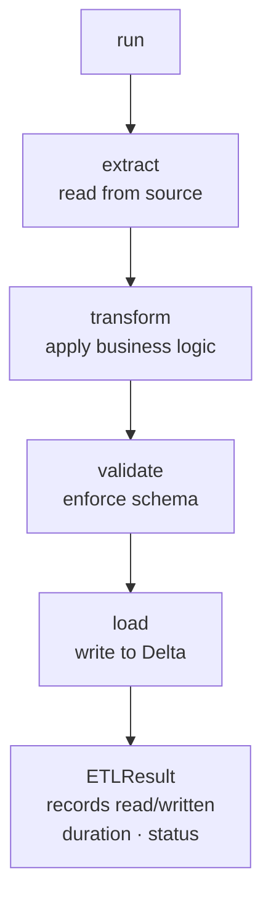
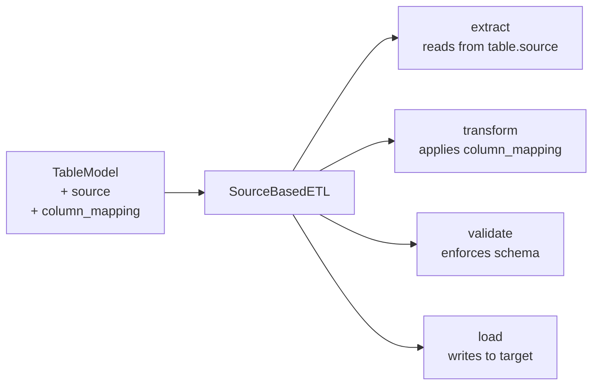
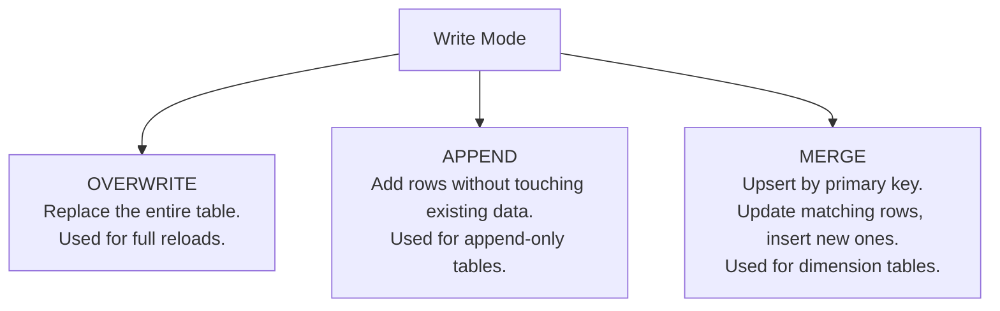
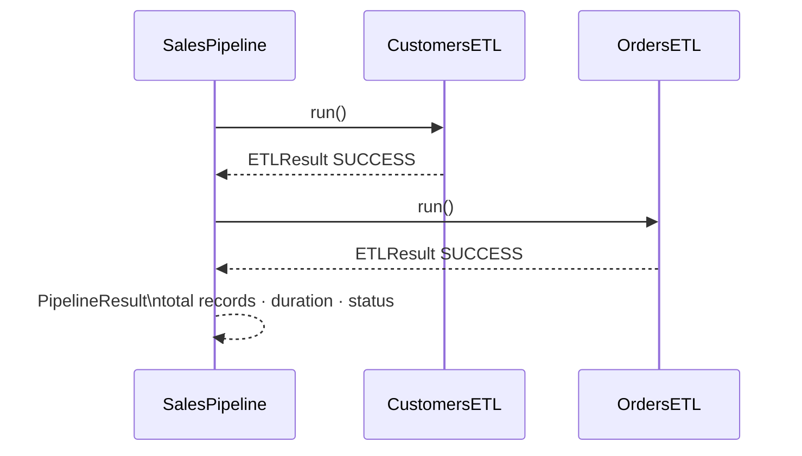
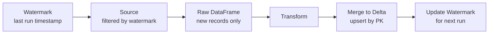

# ETL Framework

The ETL layer is where everything comes together. It uses tables, sources, and transformations to move data from source to target.

---

## The BaseETL Contract

Every ETL in TableKit follows the same contract:



`extract()`, `transform()`, `validate()`, and `load()` are separate methods. Each does one thing. You override only what you need to change.

---

## Two Ways to Use BaseETL

### Option 1: Override extract and transform

Full control over the source and transformation logic:

```
CustomETL (extends BaseETL)
├── extract()    → custom source reading logic
├── transform()  → your business transformation
└── validate()   → optional custom validation
```

Use this when the transformation is complex or the source requires special handling.

### Option 2: Source-based ETL

When a `TableModel` has a linked source and column mapping, `SourceBasedETL` handles everything automatically:



No custom code needed. Define the source and mapping at the table level, and the ETL runs itself.

---

## Write Modes



The write mode is set at the ETL level, not inside `load()`. Changing the mode does not require touching the load logic.

---

## Pipeline Orchestration

Multiple ETLs can be combined into a pipeline:



The pipeline:
- Runs ETLs in order
- Stops on failure if `fail_fast=True`
- Collects all results into a `PipelineResult`
- Reports duration and records per ETL

---

## ETLResult

Every ETL run produces an `ETLResult`:

```
ETLResult
├── table_name       → fully-qualified target table name
├── records_read     → rows read from source
├── records_written  → rows written to target
├── start_time       → run start timestamp
├── end_time         → run end timestamp
├── duration_seconds → derived: end - start
├── status           → SUCCESS or FAILED
└── error_message    → set if status is FAILED
```

This makes pipeline monitoring straightforward. Log the result, alert on failure, track trends over time.

---

## Incremental Loading

For large tables, `IncrementalETL` uses a watermark to only process new records:



Only new or updated records are processed. The watermark is stored and updated after each successful run.
