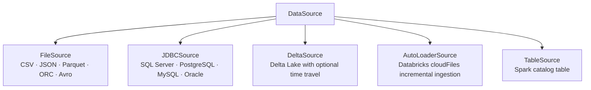
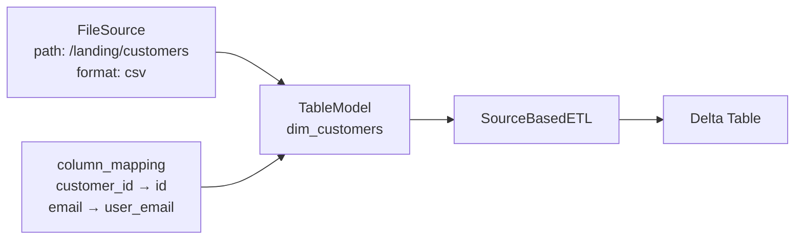
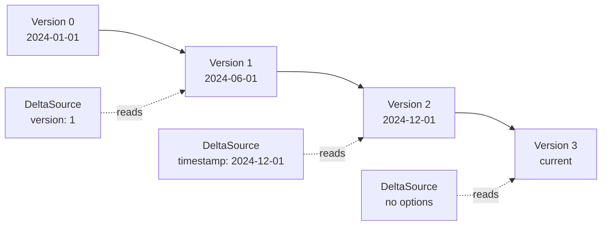
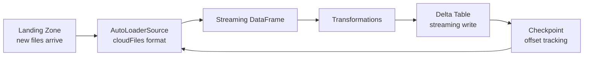

# Data Sources

A `DataSource` defines where data comes from. It is a first-class object that can be attached to a `TableModel`, passed to an ETL, or used directly.

---

## The Problem with Hardcoded Sources

In most pipelines, the source path is buried inside the ETL code:

```python
def extract(self):
    return self.spark.read.csv("/some/path/customers/")
```

This means:
- The source location is invisible from the table definition
- Changing the source requires editing the ETL class
- You cannot reuse the same source across multiple ETLs without duplication
- Testing requires mocking at the class level

---

## Declarative Sources

A `DataSource` separates the source from the logic:

```
DataSource
├── name         → identifier for this source
├── source_type  → CSV, JSON, Parquet, Delta, JDBC, AutoLoader, etc.
├── path         → file path or table location
├── options      → format-specific options (header, delimiter, etc.)
└── schema       → optional explicit StructType
```

Define it once, attach it to a table, and the ETL layer reads from it automatically.

---

## Source Types



---

## Source-Table Binding

Attaching a source to a `TableModel` makes the relationship explicit:



The `TableModel` knows:
- Where its data comes from
- How source columns map to target columns

The ETL does not need to know either. It asks the table, reads the source, applies the mapping, and loads.

---

## Time Travel with Delta

`DeltaSource` supports Delta Lake time travel for historical reads:



This is useful for incremental pipelines, auditing, and debugging production issues without needing backups.

---

## Streaming Sources

`DeltaSource` and `AutoLoaderSource` support streaming reads via `source.read_stream(spark)`:



Auto Loader tracks which files have been processed. New files are picked up automatically. No manual watermarks.
