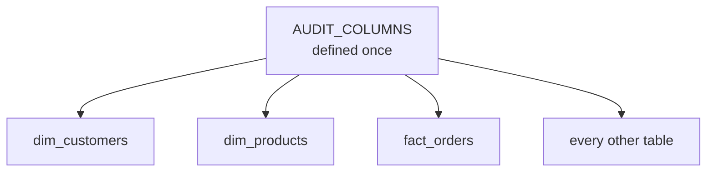
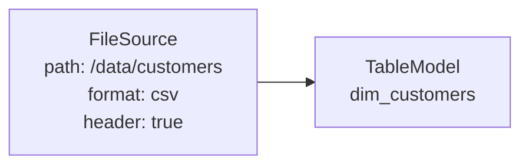
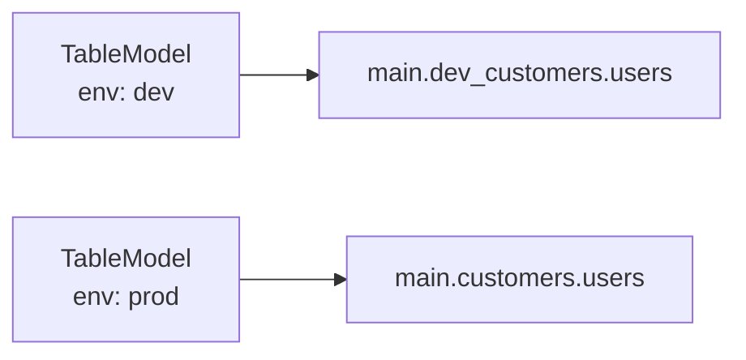
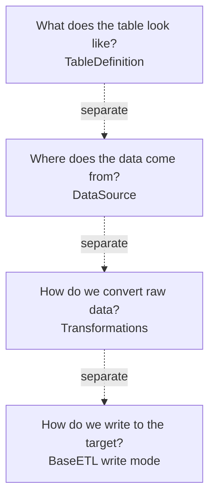
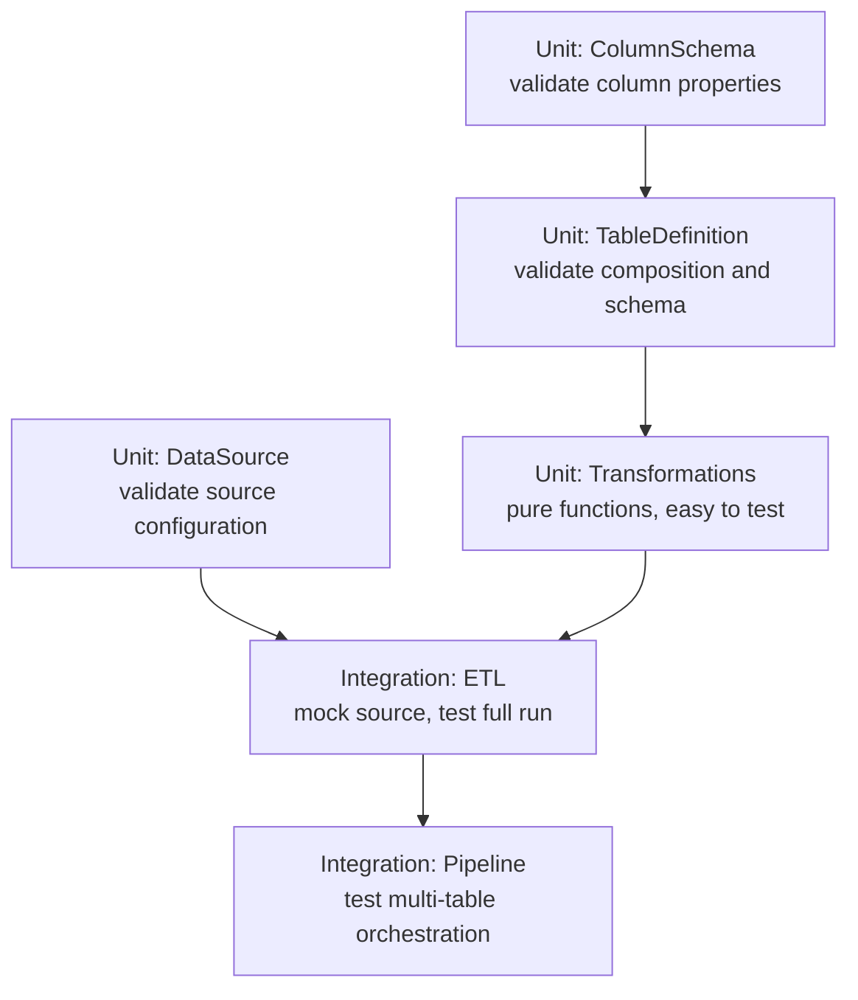

# Why TableKit

## Schema as Code

Most data teams treat schemas as a side effect of the pipeline. The schema is inferred, or it lives in a YAML file no one updates, or it's scattered across thirty `StructField` calls with no comments.

TableKit treats the schema as code. Not configuration, not documentation — code. That means:

- **Version controlled.** Schema changes go through code review.
- **Tested.** You can write tests against your schema definitions.
- **Discoverable.** IDE autocomplete works. You know what columns exist without running a query.
- **Self-documenting.** Comments are part of the schema, not a separate document.

---

## Composition Over Repetition

Every data team ends up writing the same patterns over and over:

```
created_at TIMESTAMP
updated_at TIMESTAMP
created_by STRING
updated_by STRING
```

These appear in every table. Without a framework, they get copy-pasted. One day someone adds a column in one table and forgets the others. Six months later, the schemas are different across tables and no one knows why.

TableKit solves this with composition:



Change `AUDIT_COLUMNS` in one place. Every table picks up the change.

The same applies to SCD2 columns, address structs, contact schemas — anything that appears in more than one table.

---

## Explicit Over Implicit

The two biggest sources of bugs in data pipelines are implicit assumptions and hidden state.

**Implicit source paths:**

```python
# Where does this data come from?
def extract(self):
    return self.spark.read.csv("/data/customers/")
```

**Explicit source binding:**



The table knows its source. Anyone reading the table definition knows where the data comes from without reading the ETL code.

**Implicit environment handling:**

```python
# Which environment is this?
df.write.saveAsTable("main.customers.users")
```

**Explicit environment awareness:**



The environment is set once. Every table name derives from it automatically.

---

## Separation of Concerns

In a typical notebook pipeline, schema definition, source reading, transformation logic, and write mode are all mixed together. Changing one thing requires understanding everything.

TableKit splits these into separate layers:



Each question has one answer in one place. When the source changes, you change the source. When the schema changes, you change the definition. When the transformation changes, you change the transformation.

---

## Testability

Pipelines built with TableKit are testable at every level:



Transformations are pure functions — DataFrame in, DataFrame out. Sources are injectable. The ETL contract is defined by an abstract class. Every part can be tested independently.

---

## Get TableKit

| Edition | What's included | Price |
|---------|----------------|-------|
| [**TableKit Core**](https://sagnelli.gumroad.com/l/tablekit-core) | Core library, schemas, sources, ETL framework, 43 tests, full docs | €49 |
| [**TableKit Pro**](https://sagnelli.gumroad.com/l/tablekit-pro) | Everything in Core + Databricks Asset Bundle, pipeline definitions, deployment notebooks | €99 |
